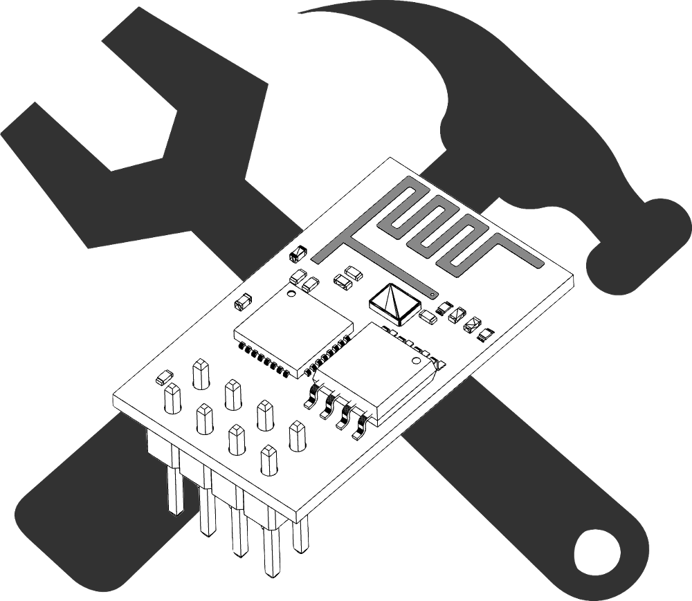
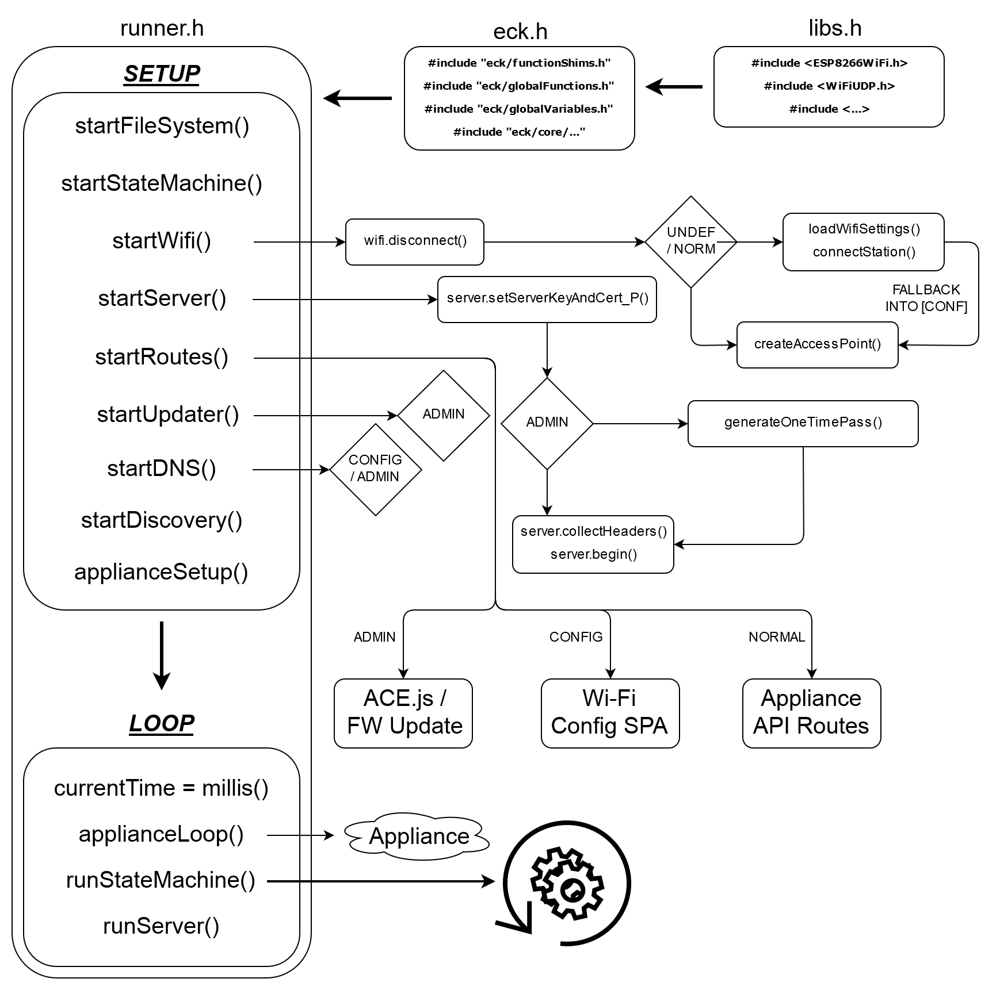

    

# ESP Express Creation Kit
**ESP-ECK is an Appliance Development Kit that enables high speed development of intelligent solutions using the ESP-8266 chipset.**
  

## Motivation
The ESP-8266 chipset in all of its form-factors is a great general purpose engine for intelligent appliances of all types, but complete Appliance Development Kits are few and far between. This project aims to provide a highly configurable and extensible foundation for developing these types of systems.

## Kit Contents
The Express Creation Kit is designed to bootstrap a project in minutes, and includes all the files needed for a simple demonstration of the Appliance Development Kit's abilities. The two major components of the ECK are a firmware responsible for a lot of behind-the-scenes plumbing, and a set of Single-Page-Applications which serve as the visual interface for users of the appliance.

**Firmware**

At the heart of the ECK ADK is an _Arduino_ style firmware for the ESP-8266 chipset that enables the following features:
 - GUI based bootstrapping of connection to local Wi-Fi network
 - HTTPS web server with user-generated x509 SSL keys
 - Flexibly authorized firmware updates for hardware
 - Real-time API routes that are simple and extensible
 - HTML-based editor for onboard file system edit/upload/delete
 - UDP broadcast custom protocols for auto-discovery services

**Software**

The ECK ADK contains a basic [ESPALIF](https://github.com/swissarmybud) project that can be modified and extended to provide a modern GUI interface for interacting with the appliance. The following applications are included:
 - Device Configuration (`index`)
 - Network Configuration (`config`)
 - File System Editor (`edit`)
 - OTA Firmware Updater (`update`, `updateEr`, `updateOk`)
 - Mock Appliance GUI (`home`)
 

## Firmware Features

**GUI or Bootstrap to Local Wi-Fi**

By default the ECK will try to read local Wi-Fi credentials from its file system, and connect if it can find them. Failing that, it will fall back to launching its own secured Wi-Fi network and serving the `config` SPA to visitors - which collects and saves Wi-Fi credentials.

**SSL Enabled HTTP Server**

The onboard HTTP server is fully SSL supported and allows for the generation and use of self-signed x509 keys, or the import of existing keys from a Certificate Authority. These keys wrap every communication that goes "over the wire", securing firmware updates, API surfaces, and all other content exchange.

**Flexibly Authenticated Firmware Updates**

One of the biggest challenges facing appliance deployment is the need to develop and include an Over-The-Air firmware update system in case devices need to be updated in the field. The ECK includes an integrated OTA firmware updater that is wrapped by the upstream SSL tunnel, and has configurable authorization to secure the process from end-to-end. Users can choose to generate One-Time-Pass tokens and retrieve them from the appliance, or rely on included credentials when trying to authenticate an update user. The `update` SPA provides a simple interface for updating firmware using OTP tokens to authenticate.

**Flexible, Extensible API**

The standard method for adding and handling routes in an `.ino` sketch are followed in the ECK. Routes are activated in batches and can be written inline or called from function pointers, meaning API code is easy to organize and manage across the entire appliance project. GET and POST pairs in the API can be used to enable bi-directional communication in near real-time, and everything is securely wrapped with the SSL layer by default.

**Onboard File System Editor**

ESP-ECK integrates the [Ace.js Editor](https://github.com/ajaxorg/ace), loading it in the included `edit` SPA. It allows for basic control of the file system and light editing tasks, although larger files are not well supported due to the relatively slow network stack on the ESP-8266. The default appliance only provides the editor in `ADMINISTRATION` mode but the route can be activated at any time in a custom appliance.

**UDP Discovery Service**

Discovery services are second only to firmware update services when developing appliances for the real world, and the ECK includes a UDP broadcaster straight out of the box. Messages can be customized protocol or use exiting formatting libraries to send discovery notices across the network.

## Architecture
The ECK imports three main `.h` files which handle all of the library imports, function definitions, static variable and object initializations, and executing the underlying `setup()` and `loop()` functions. Exposed in the main firmware body are `applianceSetup()` and `applianceLoop()`, where all appliance related activity takes place. Separation of concerns inside the ECK is made apparent where possible, to make parsing and modification easier for end users of the ECK - comment chunks help delineate the different areas of some files.

**Visual Outline:**

    

## Example / Bootstrapping
The following steps must be performed to get the demonstration appliance working:
1. [Have the Arduino IDE installed and compiling the default project](https://www.arduino.cc/en/main/software)
2. [Ensure that the `esp8266 by ESP8266 Community` board package is installed](https://github.com/esp8266/Arduino)
3. [Have an ESP8266 module, connected and ready to program](https://www.adafruit.com/product/2821)
4. Open the ESPECK `Firmware.ino` file in the Arduino IDE
5. Make sure to select the correct ESP8266 board under the `Tools` menu
6. Ensure that the `Tools/Flash Size` menu selection includes a SPIFFS partition
7. Under the `Tools` menu, select `ESP8266 Sketch Data Upload`
8. Upload firmware to the board from the `Sketch` menu by selecting `Upload`

## Custom Appliances
Users of the ECK will quickly get tired of blinking LEDs - fortunately the ECK has been designed to make it simple to extend and customize all of its parts. The ECK exposes both an `applianceSetup()` and `applianceLoop()` to ensure familiarity with runtime layout of code, and has separated the HTTP server's routes into component files under `/eck/routes` for simplified route/API building. Different style of route functions/callbacks are demonstrated, as is configuring appliance variables from the included GUI. The interface can be customized by [installing Node.js](https://nodejs.org/en/) and having the [`gulp-cli` package installed globally](https://gulpjs.com/docs/en/getting-started/quick-start), then modifying the files under `Interface/especk` and rebuilding the project.
